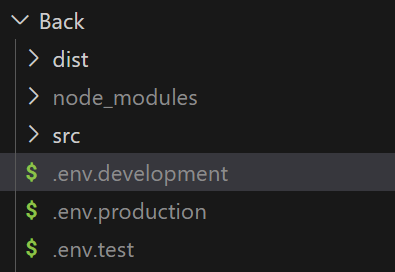

# **Radio Advertisement Management Project**

***

## **Information**
This project was developed by students of the National Technological University.

## **Description**
This web application is designed for radio station administrators and operators. Its functionalities focus on managing advertising contracts and tracking advertisement broadcast orders efficiently.

## **Installation**

### **Install Node.js**
The NPM package manager comes with Node.js and is required for this project.

#### **Windows:**
1. Download the installer from [https://nodejs.org/en/download/](https://nodejs.org/en/download/).
2. Run the `.msi` file and follow the installation instructions.
3. Verify the installation by running the following commands in a new terminal window:
    ```sh
    node -v
    npm -v
    ```

#### **Linux (Ubuntu):**
1. Open the terminal.
2. Install Node.js and NPM by running:
    ```sh
    sudo apt update
    sudo apt install nodejs npm
    ```
3. Verify the installation:
    ```sh
    node -v
    npm -v
    ```

### **Clone the Repository**
1. Open the terminal.
2. Navigate to your desired directory.
3. Run the following commands:
    ```sh
    git clone https://github.com/victoria-peinado/Desarrollo-Gesti-n-de-Publicidad
    cd Desarrollo-Gesti-n-de-Publicidad
    ```

### **Install Dependencies and Configure the Project**

#### **Backend Configuration:**
1. Navigate to the backend directory:
    ```sh
    cd Back
    ```
2. Install backend dependencies:
    ```sh
    npm install
    ```
3. Set up backend environment variables:
   - Create three environment files inside the `Back` folder: `.env.development`, `.env.production`, and `.env.test`.
   

   - Each file should contain the following variables:
     ```sh
     PORT=
     FRONTEND_URL=
     DATABASE_NAME=
     CONNECTION_STRING=
     JWT_SECRET=
     ```
4. If you are using `.http` files to test API requests, make sure to set the correct port before running any request.
For example, if your `.env` file contains:
    ```sh
   PORT=4000
    ```
Then, modify your `.http`  files like this:
    ```sh
    @port = 4000
    ```
5. Return to the project's root directory:
    ```sh
    cd ..
    ```

#### **Frontend Configuration:**
1. Navigate to the frontend directory:
    ```sh
    cd Front
    ```
2. Install frontend dependencies:
    ```sh
    npm install
    ```
3. Configure frontend environment variables as needed. **TODO**
4. Return to the project's root directory:
    ```sh
    cd ..
    ```

## **Running the Application**

### **Start the Backend**
### **Start the Backend**  
Make sure you are inside the `Back` folder.  
- If this is your first time running the application, execute `npm run _start:dev` or `npm run _start:prd`. If you are using Linux, you must also delete the `dist` folder before compiling again.  
- Development mode:  
    ```sh
    npm run start:dev  
    ```  
- Production mode:  
    ```sh
    npm run start:prod  
    ```  

### **Start the Frontend**
Make sure you are inside the `Front` folder: **TODO**
- Run the following command from the project's root directory:
    ```sh
    npx ng serve -o
    ```

## **Usage Examples**
*(Include examples of how to use the application, along with screenshots or GIFs to demonstrate functionality.)*

## **Running Tests**
*(Explain how to run tests for both frontend and backend, including the necessary commands.)*

## **License**
This project is licensed under the [MIT License](https://opensource.org/licenses/MIT). See the `LICENSE` file for more details.